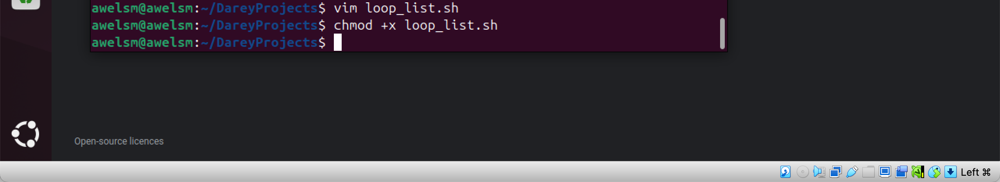
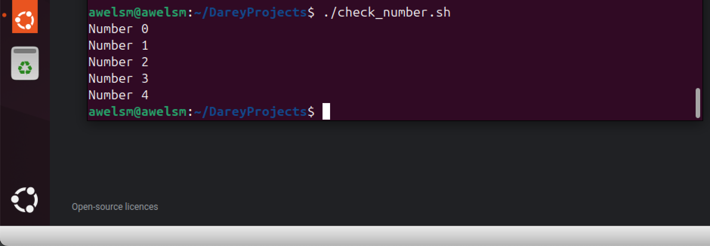

# LinuxShellScriptingControlFlows
here i will be submitting my project on control flows in linux shell scripting

# INTRODUCTION 
Control flow in Linux shell scripting refers to the logical structures that determine how and when different parts of your script are executed. Instead of just running line-by-line top to bottom, your script can now make decisions, run loops, and branch out depending on conditions.

# ADVANTAGES OF CONTROL FLOWS IN SHELL SCRIPTING
Advantages of Control Flow in Shell Scripting

1. Adds Logic and Intelligence - Allows your script to make decisions and respond to different situations (e.g., if-else, case). It also makes automation smarter and more context-aware.
   
2. Enables Repetition Without Redundancy - With loops (for, while, until), you can repeat tasks automatically—no need to write the same code multiple times.
   
3. Improves Code Efficiency and Cleanliness - Avoids code duplication by letting the same logic handle multiple scenarios or inputs. it also Reduces human error in repetitive tasks.
   
4. Supports Automation of Complex Tasks - Enables dynamic behavior in scripts, such as processing files, handling user input, or automating system maintenance.
   
5. Increases Reusability and Scalability - A well-structured control flow lets your script adapt to growing tasks without major rewrites.

6. Facilitates Error Handling and Validation - You can check for errors (e.g., file existence, permissions) and handle them gracefully with conditionals.

# CREATING A FILE
The first task is to create a file called "control_flow.sh". I did this by using the ommand "vim control_flow.sh". the image below depicts this 

# PUTTING THE CODE INTO THE SCRIPT
The next step is to put the code "    read -p "Enter a number: " num " in the script and then execute the script and experience what happens next. the image below depicts this 

the image above shows that the code is successfully inputed in the script and the next thing to do is to executte the script so that i can experience what happens next. 

# EXECUTION OF THE SCRIPT 
The way of the execution of this script is by running this command "./control_flow.sh" 
however before i could successfully execute the script i had to give myself the right to execute the script using this command "chmod +x control_flow.sh" then i went ahead to successfully execute the script. the image below depicts this 

immediatly i executed the script i was asked to enter a number of which i entered 12 as the number. And even though i cannot visibly see what it does with the number. It is because the read command in the script has its own way of taking inputs from the userss and storing the value into a variable passed to the read command. 

# PUT MORE CODE INTO THE SCRIPT. 
I imputed this into the script "#!/bin/bash
read -p "Enter a number: " num
echo "You have entered the number $num"

the image below depicts this 

after imputing this, i executed the script and the echo command came through. the image below depicts this. 

# The IF Statement
I added this code into the script 

"if [ "$num" -gt 0 ]; then
    echo "The number is positive."
fi

the image elow depicts this 

this shows that the script has been executed successfully. 

# The elif statement

I added this command into the script and executed the script. the image below depicts this 

this is the new code in the script
#!/bin/bash
read -p "Enter a number: " num
echo "You have entered the number $num"
if [ $num -gt 0 ]; then
    echo "The number is positive."
elif [ $num -lt 0 ]; then
    echo "The number is negative."
fi

the image below depicts this. 

after putting this on the script, i executed the script. i executed the script using both numbers greater than 0 and less than 0 to get two differnt results. 
the image below depicts this 

# LOOPS

THE FOR LOOP 

I created a bash scipt and ran this code on it 
"for item in item1 item2 item3; do
    echo $item
done" 

after which i gave myself the right to execute the script using this command "chmod +X". after i got the r9iight to execute the script, i went ahead to execute the script and it was successfully. the images below depicts these.

i went ahead to add another code using the for loop to the same script and I executed the script. this went successfully and the image below depicts this.

#!/bin/bash

for i in 1 2 3 4 5
do
    echo "Hello, World! This is message $i"
done

i added a new command again to illustrate the for loop and the command is below
for a in {"1..5"}
do
    echo "Counting... $a"
done

i ran the script and executed the script successfully. the image below depicts this 

The C STYLE OF LOOP 
I ran this command 
for (( i=0; i<5; i++ )); do
    echo "Number $i"
done

## EXPLANATION
- "First Iteration:" i=0, condition 0<5 is true, prints "Number 0", increments i to 1.
- "Second Iteration:" i=1, condition 1<5 is true, prints "Number 1", increments i to 2.
- "Continues iteration" ...
- "Fifth Iteration:" i=4, condition 4<5 is true, prints "Number 4", increments i to 5.
- "Sixth Check:" i=5, condition 5<5 is false, loop ends.

The image below depicts this

the image above depicts that it was successful. 

## The While Loop
I created a new script using the while loop and executed the script. the image below depicts this.

## The Until loop
The key difference between the while loop and the until loop is:

while loop keeps going while a condition is true

until loop keeps going until a condition becomes true

i ran this code in the new script to represent the until loop 

#!/bin/bash

number=1

until [ $number -gt 5 ]
do
  echo "This is number $number"
  number=$((number + 1))
done

echo "All done!"

the image below depicts this 

the image below shows that this 

## Conclusion
Understanding control flow in shell scripting is essential for writing efficient and intelligent automation scripts. Through the use of while loops, until loops, and if statements, we can direct a script to behave dynamically — responding to conditions, repeating tasks, and making decisions as needed. These tools are the foundation of logic in Bash scripting and are vital for solving real-world problems in system administration, DevOps, and automation workflows. Mastery of control flow not only simplifies complex tasks but also enhances the reliability and flexibility of scripts in any Linux-based environment. 